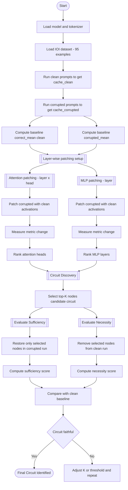

# Circuit Discovery for IOI Task on Llama3.2 1B Variant

### This code was written completely by hand (with no help of AI, or any interpretability-based package like transformer_lens)
(Only data generation code is generated by Claude)

This is my submission to Lexsi Labs as an Assignment to do circuit Discovery over Llama 3.2 1B variant for the IOI task.

The dataset was created using a template (present in the code file).

The main code file is `complete_run.ipynb`, where all the code for this assignment has been written by me. (the first half is related to layer-by-layer activation patching and finding the most important layers, I am still working on the second half related to token-by-token activation patching. Thank you for understanding.)

This was a very challenging task as it was very difficult to code all the logic and the process by hand without using AI. 

The configurations are as follows:
- **model** - meta-llama/Llama-3.2-1B
- **precision** - float16 (fp16)
- **batch size** - 1
- **sparsity** - 17 ( based on the threshold of 0.3) (for layer-by-layer)
- **seeds** - [42, 54, 67]
- **Device** - mps

(The threshold is based on the difference of the mean of the logit difference of the values of the correct and wrong character in the sentence of the correct sentences and the same after activation ppatching in certain laywrs of token).

The workflow goes like:

The workflow consists of complete layer patching, to identify the nodes and edges most important. 

The **Runtime** is around 30 mins, with **Peak VRAM** utlisation exceeded nearly 2.45GB.

## Circuit Discovery & Validation (IOI Task)

The following table summarizes the performance of the discovered circuit compared to the full model and various baselines. The **Indirect Object Identification (IOI)** task was used as the primary benchmark.

| Model / Configuration | IOI Score (Logit Diff) |
| :--- | :---: |
| **Original (Full Model)** | 5.3867 |
| **Discovered Circuit (Sufficiency)** | 0.4080 |
| **Discovered Circuit (Necessity)** | 0.4951 |
| **Random Baseline (Necessity) (Layer)** | 0.6655 |
| **Discovered Circuit (Sufficiency) (Token based patching)** | 0.5337 |
| **Discovered Circuit (Necessity) (Token based patching)** | 0.5210 | 
**Random Baseline (Necessity) (Token Based patching)** | 5.2227 |

Necessity means how important those nodes are for the model to predict, which is done by patching the chosen mlp layers and attention heads with corrupted activations, therefore, lesser the score, the better (showing dependency of the model over these particular components)

Sufficiency is when the model uses only those nodes selected and gives the correct prediction (closer to the actual predictions), showing that the model can perform only using those specific components inside, while the rest are patched with corrupt activations.

Random baseline results are based on necessity, and as we can see, the baseline performs better with removal of random components rather than the important ones, showing the role they play in developement of model understanding. As the model is of only 80 components (16 total MLP layers with 16*4 attention heads), we can see how each component plays an important role.

A total of 7 MLP Layers and 10 Attention heads were selected which crossed the threshold of 0.3. I considered the same configurations for random baseline.

Sparsity for token-by-token is 28 MLP token-layers and 21 attention heads (49/1280 components ~ 3.8%)

## Observations
Based on the study of patching complete layers - 

The identified circuit consists of 10 attention heads and 7 MLPs that is NECESSARY for the task (ablating these components reduces performance from 5.38 to 0.4951). 

However, the circuit alone is not SUFFICIENT to fully preserve behavior (keeping only these components yields ~0.4 logit difference vs 5.38 for the full model). This necessity-sufficiency gap is consistent with findings on larger models, indicating distributed computation across multiple pathways.

## 3 Key Takeaways

- Circuit discovery is a very important task for interpetability in LLMs, as it helps in recognizing the most important layers and attention heads required for that particular output.
- The whole code found the most important nodes and edges, and less than 21% of the total edges (17/80) were considered to be important on the basis of necessity. While the performance of sufficiency did not show great results, a reason for this may be due to the model being small with less number of components (80) making each component important.
- The code was seen to be stable across different seeds (42, 54 and 67).
- The baseline random masking results showed that randomly selecting mlp layers and attention heads in the same count as the ones selected, showed worse results in necessity (by giving.a higher score), meaning the random selected were not as important as the ones selected by activation patching.

## Future Work

While submitting this, I am also working on token by token patching ( that is for every token, every layer/component is patched) after layer by layer. Its the continuation of the ipynb file. I have written all codes by hand as I believe every assignment is a learning process and that it should be done by hand for better in-depth understanding of the tasks that may be done in the organisation.
